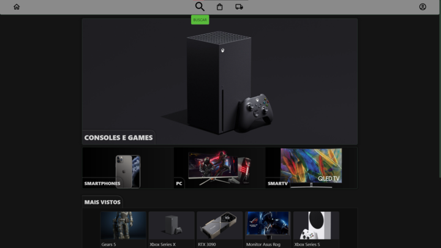
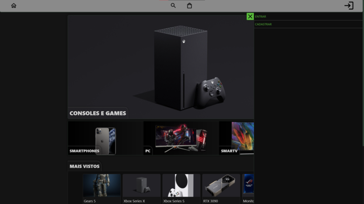
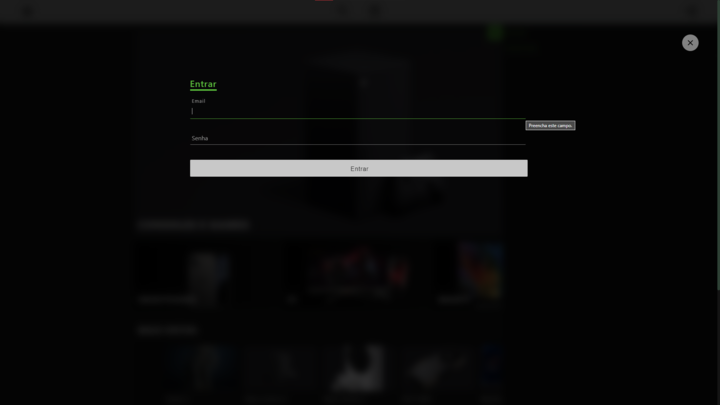
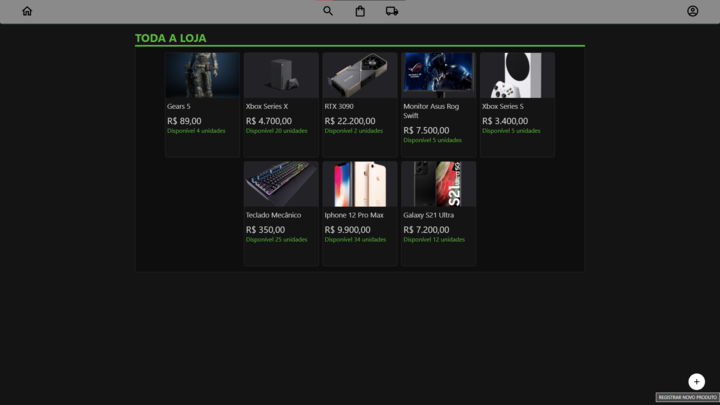
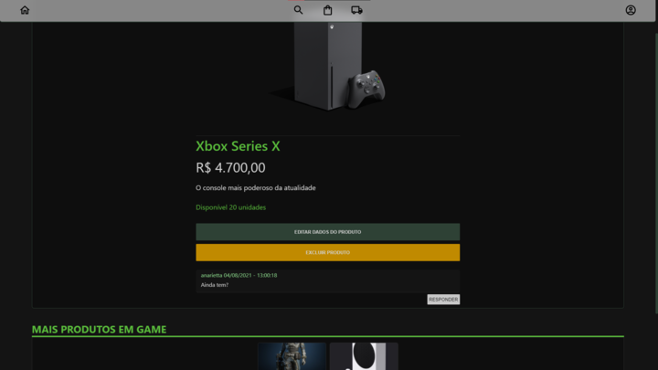
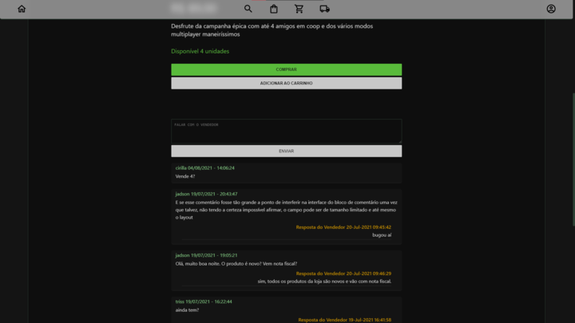

# Loja

- dados vendedor
    - email: jadson@gmail.com
    - senha: jadson

## Tela inicial
</img>

## Menu Lateral
</img>

## Tela de Login
</img>

## Tela com todos os produtos
</img>

## Tela com produto selecionado
</img>

## Conversa com o vendedor
</img>

# O que tem em cada tela

## Tela Inicial
- na parte superior mostra as 4 categorias de produtos
- na parte inferior mostra os 10 produtos mais vistos 

## Tela com produto selecionado 
- abre o produto e apresenta botões de compra e adicionar ao carrinho se o usuário estiver logado e se não for o vendedor
- para o vendedor aparecem opção de editar e excluir o produto
- formulário de conversa com o vendedor só aparece para usuário logado
- o botão de responder só aparece para o vendedor em comentários que ele ainda não respondeu
- mais abaixo são mostrados outros produtos que pertencem à categoria do produto selecionado

# Funcionalidades

## Aplicação
- produtos indisponíveis não são vendidos e não aparecem entre os mais vistos
- cada clique em um produto adiciona +1 no campo clique no banco de dados, o que faz o produto subir entre os mais vistos
- o produto aberto na página de compras não aparece entre os recomendados abaixo dele
- os cards de produtos apresentam um ícone "+" que, ao clique, adiciona o produto no carrinho do usuário

## Usuário
- "compra" o produto que é adicionado automaticamente na sua página de compras
- adiciona ou remove produtos do carrinho
- envia mensagem no chat

## Vendedor
- tem acesso a página com o histórico de tudo que já foi vendido
- pode adicionar novo produto clicando no "+" que aparece na página com todos os produtos
- pode editar ou excluir produtos

